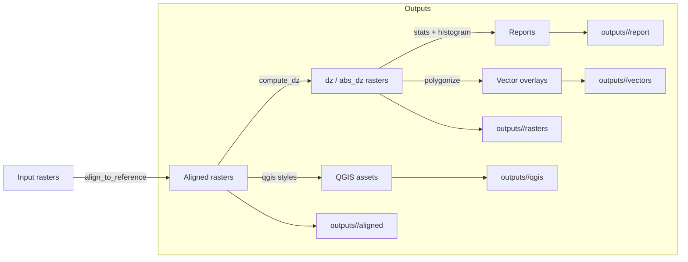

# Architecture

## Components

- `scripts/run_from_config.py`: YAML-driven entrypoint.
- `raster_compare/core.py`: alignment and dz computation.
- `raster_compare/report.py`: statistics, histogram, and Excel report generation.
- `raster_compare/qgis.py`: QGIS assets and vector overlays.
- `raster_compare/polygon_mosaic.py`: polygon-based mosaic pipeline.

## Data flow + artifacts

## Output artifacts

- **GeoTIFFs**: aligned rasters, signed dz, absolute dz.
- **Excel**: summary statistics, area-by-threshold tables, histogram, alignment report.
- **GeoJSON**: exceedance polygons (abs or signed dz).
- **QGIS styles**: QML files for easy symbology.
- **Logs**: alignment report JSON/CSV under `report/`.

See [pipeline_overview.md](pipeline_overview.md) for detailed pipeline steps.
