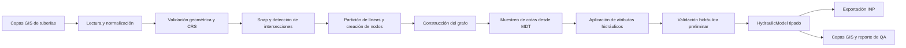

# Arquitectura propuesta: herramientas GIS → EPANET

## 1. Propósito y alcance

Este documento define la base técnica para incorporar al repositorio **Spatial Analysis** una biblioteca Python orientada a crear, editar, validar y analizar modelos hidráulicos de EPANET a partir de datos GIS.

El objetivo inicial es transformar una red de tuberías en formato vectorial, junto con un MDT/DEM y atributos hidráulicos, en un archivo `.inp` válido y trazable. La solución no se limita a un conversor puntual: debe permitir automatizar flujos GIS–EPANET, editar redes en bloque, importar resultados y producir productos cartográficos aptos para QGIS/QEPANET.

### Principios rectores

- Mantener la lógica hidráulica separada de los scripts de ejecución y de la interfaz QGIS.
- Preservar los datos fuente: las correcciones automáticas deben generar capas o artefactos nuevos, nunca sobrescribir el insumo silenciosamente.
- Trabajar con identificadores estables, reglas explícitas y reportes de validación reproducibles.
- Hacer que cada paso pueda usarse como módulo Python, mediante CLI y mediante una configuración YAML.
- Agregar dependencias complejas solo cuando aporten una capacidad concreta y estén cubiertas por pruebas.

---

## 2. Encaje en el repositorio existente

El repositorio ya utiliza paquetes de lógica reutilizable, scripts de entrada y flujos declarados en YAML. La funcionalidad de redes hidráulicas debe incorporarse como un paquete independiente, no dentro de `raster_compare`, porque sus modelos de datos, validaciones y salidas son distintos.

Estructura propuesta:

```text
spatial_analysis/
├── epanet_gis/                         # Biblioteca GIS–EPANET
│   ├── __init__.py
│   ├── models.py                       # Dataclasses y contratos internos
│   ├── exceptions.py
│   ├── config.py                       # Lectura/validación de YAML
│   │
│   ├── io/
│   │   ├── vector.py                   # Shapefile, GeoPackage, GeoJSON
│   │   ├── raster.py                   # DEM/MDT y muestreo de elevaciones
│   │   ├── epanet_inp.py               # Escritura/lectura controlada de .inp
│   │   └── results.py                  # Resultados de EPANET
│   │
│   ├── topology/
│   │   ├── validation.py               # Geometrías, CRS, duplicados, extremos
│   │   ├── snapping.py                 # Snap por tolerancia explícita
│   │   ├── intersections.py            # Detección y partición de cruces
│   │   ├── nodes.py                    # Junctions y nodos terminales
│   │   ├── graph.py                    # Conversión a NetworkX
│   │   └── identifiers.py              # IDs únicos y estables
│   │
│   ├── terrain/
│   │   ├── elevations.py               # Cotas de nodos desde DEM
│   │   └── crs_units.py                # CRS proyectado, unidades y chequeos
│   │
│   ├── hydraulic/
│   │   ├── schema.py                   # Campos hidráulicos y valores por defecto
│   │   ├── pipes.py                    # Longitudes, diámetro, rugosidad, estado
│   │   ├── demands.py                  # Demandas base y patrones
│   │   ├── elements.py                 # Reservorios, tanques, bombas, válvulas
│   │   └── model_builder.py            # Modelo hidráulico intermedio
│   │
│   ├── editing/
│   │   ├── bulk.py                     # Ediciones masivas por atributos/filtros
│   │   ├── selection.py                # Selección espacial por polígonos
│   │   └── rules.py                    # Reglas auditables de actualización
│   │
│   ├── analysis/
│   │   ├── network.py                  # Componentes, conectividad, grados
│   │   ├── criticality.py              # Elementos críticos y cuellos de botella
│   │   ├── sectorization.py            # Utilidades de sectorización futuras
│   │   └── statistics.py               # Resúmenes hidráulicos y GIS
│   │
│   ├── visualization/
│   │   ├── layers.py                   # GeoPackage/GeoJSON de salida
│   │   ├── styles.py                   # Activos QML opcionales
│   │   └── thematic.py                 # Mapas de presión, velocidad, caudal
│   │
│   └── workflows/
│       ├── build_model.py              # Orquestación GIS → modelo → .inp
│       ├── validate_network.py
│       └── import_results.py
│
├── scripts/
│   ├── run_from_config.py              # Se mantiene para flujos existentes
│   ├── build_epanet_model.py           # CLI de construcción de modelo
│   ├── validate_epanet_network.py      # CLI de validación
│   └── import_epanet_results.py        # CLI futuro
│
├── config/
│   └── epanet_model_example.yml
├── docs/
│   ├── epanet_gis_architecture.md
│   ├── epanet_gis_data_contract.md
│   └── epanet_gis_workflow.md
├── tests/
│   ├── epanet_gis/
│   └── data/                           # Datos sintéticos, pequeños y versionables
└── qgis/                               # Estilos y, en una fase futura, plugin
```

> La carpeta `qgis/` debe contener inicialmente estilos y recursos. Un plugin QGIS completo debe ser una capa posterior que consuma la biblioteca `epanet_gis`, sin duplicar la lógica de negocio.

---

## 3. Modelo de datos y contrato mínimo

### 3.1. Datos de entrada

**Tuberías**

- Geometría: `LineString` o `MultiLineString` (estas últimas se deben explotar antes de construir la topología).
- CRS: proyectado y con unidades métricas para longitudes y tolerancias. Si el CRS es geográfico, el flujo debe detenerse con un mensaje accionable.
- Atributos iniciales: opcionales. La ausencia de diámetro, rugosidad o material no debe impedir crear la topología, pero sí debe quedar indicada como advertencia antes de exportar un modelo hidráulico ejecutable.

**MDT/DEM**

- Raster georreferenciado que cubra los nodos de la red.
- Deben verificarse CRS, unidades verticales, `nodata` y cobertura de todos los nodos.
- La elevación de cada nodo debe conservar trazabilidad: valor, método de muestreo y fuente raster.

**Capas auxiliares**

- Puntos de consumo/demanda, válvulas, tanques, reservorios, bombas, sectores y parcelas.
- Cada tipo se incorporará mediante adaptadores específicos, no como campos genéricos sin semántica.

### 3.2. Modelo interno intermedio

Antes de escribir un `.inp`, el flujo construirá un modelo tipado e independiente del formato EPANET:

```text
HydraulicModel
├── nodes: dict[str, Node]
├── pipes: dict[str, Pipe]
├── reservoirs: dict[str, Reservoir]
├── tanks: dict[str, Tank]
├── pumps: dict[str, Pump]
├── valves: dict[str, Valve]
├── patterns: dict[str, Pattern]
├── metadata: ModelMetadata
└── validation_report: ValidationReport
```

Cada `Node` y `Pipe` tendrá un identificador único, geometría o coordenadas, atributos hidráulicos, procedencia y estado de validación. Este modelo permite validar y editar antes de serializar a EPANET.

### 3.3. Identificadores

- Nodos: `J000001`, `J000002`, …
- Tuberías: `P000001`, `P000002`, …
- Elementos especiales: prefijos distintos (`R`, `T`, `PU`, `V`) para evitar ambigüedad.
- Si existen IDs GIS válidos, deben conservarse en `source_id`; el ID EPANET se genera o valida por separado.
- La asignación debe ser determinística: mismo insumo y misma tolerancia → mismos IDs, salvo que el usuario solicite regenerarlos.

---

## 4. Flujo GIS → EPANET propuesto



### Paso 1 — lectura y normalización

1. Leer una o varias capas de tuberías.
2. Convertir geometrías a `LineString` simples.
3. Reproyectar a un CRS métrico definido por configuración, cuando sea necesario y seguro hacerlo.
4. Conservar fuente, capa y atributos originales.

### Paso 2 — validación topológica

El informe debe detectar, como mínimo:

- geometrías nulas o inválidas;
- líneas de longitud cero;
- extremos no coincidentes dentro de tolerancia;
- duplicados geométricos;
- intersecciones internas entre líneas;
- `MultiLineString` sin explotar;
- componentes desconectados;
- nodos demasiado cercanos;
- nodos sin cota disponible;
- atributos hidráulicos faltantes o no válidos.

La validación debe clasificar cada hallazgo como `error`, `warning` o `info` y producir una capa de incidencias para revisión en QGIS.

### Paso 3 — corrección controlada

Las correcciones automáticas deben ser opcionales y configurables:

- `snap_tolerance_m`: unir extremos próximos con una tolerancia explícita;
- `split_at_intersections`: dividir en cruces reales;
- `drop_zero_length`: eliminar líneas degeneradas, registrando la decisión;
- `deduplicate`: detectar y tratar duplicados según una política declarada.

**Regla importante:** una intersección geométrica no siempre es una conexión hidráulica. En cruces a distinto nivel, pasos elevados o cruces sin unión, el usuario debe poder marcar `connect_at_crossing = false` o suministrar una capa/regla de excepciones.

### Paso 4 — creación de nodos y tuberías

- Crear Junctions para extremos y para puntos de división válidos.
- Asignar a cada Pipe sus nodos `from_node` y `to_node`.
- Calcular longitud desde geometría en CRS métrico.
- Generar el grafo NetworkX y validar conectividad.

### Paso 5 — elevaciones desde MDT

- Muestrear el MDT por defecto con método `nearest` en las coordenadas de nodo.
- Guardar elevación, raster fuente y estado de cobertura.
- Cuando el nodo cae en `nodata`, reportarlo como error bloqueante salvo que se defina una política de imputación explícita.

### Paso 6 — atributos hidráulicos

Los atributos pueden provenir de tres fuentes, con precedencia documentada:

1. atributo existente de la capa;
2. reglas de configuración (por material, sector, diámetro o selección espacial);
3. valor por defecto global.

Los campos internos mínimos para una Pipe son:

| Campo | Descripción | Requisito para exportar |
|---|---|---|
| `id` | identificador EPANET | sí |
| `from_node`, `to_node` | conectividad | sí |
| `length_m` | longitud calculada | sí |
| `diameter_mm` | diámetro nominal | sí |
| `roughness` | coeficiente compatible con fórmula de pérdidas | sí |
| `minor_loss` | pérdida menor | sí, con default explícito |
| `status` | OPEN/CLOSED/CV | sí, con default explícito |
| `material` | material descriptivo | recomendable |

### Paso 7 — exportación y QA

La exportación debe generar como mínimo:

```text
outputs/<nombre_modelo>/
├── model/<nombre_modelo>.inp
├── gis/<nombre_modelo>_network.gpkg
├── gis/<nombre_modelo>_qa_issues.gpkg
├── report/<nombre_modelo>_validation.json
├── report/<nombre_modelo>_validation.csv
├── report/<nombre_modelo>_summary.json
└── config/<nombre_modelo>_resolved.yml
```

El archivo `resolved.yml` permite reconstruir el modelo exactamente con la misma configuración.

---

## 5. Dependencias

### Base existente / inmediata

- `geopandas`, `shapely`, `pyogrio`, `fiona`, `pyproj`
- `rasterio`
- `numpy`, `pandas`
- `pyyaml`
- `networkx` (agregar en la primera fase EPANET)

### Herramientas de calidad recomendadas

- `pytest`
- `ruff`
- `mypy` (gradual; comenzar por el paquete nuevo)
- `pre-commit`

### EPANET

La primera exportación puede escribir `.inp` mediante un serializador propio, de alcance limitado y bien probado. Para ejecutar simulaciones, importar resultados y cubrir completamente la semántica de EPANET, se evaluará una integración con una biblioteca Python compatible con la versión de EPANET definida por el proyecto.

Esto se deja deliberadamente como decisión de la Fase 2: primero hay que fijar el formato de salida objetivo, la versión de EPANET y si se requerirá ejecutar el motor desde Python o solamente producir archivos consumibles por EPANET/QEPANET.

---

## 6. Configuración YAML propuesta

```yaml
pipeline: epanet_build
name: red_ejemplo
outdir: outputs

inputs:
  pipes:
    - path: data/red_tuberias.gpkg
      layer: tuberias
  dem: data/mdt.tif
  demand_points: null
  sectors: null

spatial:
  working_crs: EPSG:32721
  snap_tolerance_m: 0.20
  split_at_intersections: true
  connect_at_crossings: true
  sample_elevation_method: nearest

topology:
  explode_multilines: true
  drop_zero_length: true
  deduplicate_policy: report_only
  disconnected_network_policy: warning

hydraulics:
  units:
    flow: LPS
    headloss: H-W
  pipe_defaults:
    diameter_mm: 63.0
    roughness: 140.0
    minor_loss: 0.0
    status: OPEN
  field_mapping:
    diameter_mm: diametro
    roughness: rugosidad
    material: material

export:
  inp: true
  geopackage: true
  validation_report: true
  qgis_styles: true
```

El valor por defecto de diámetro o rugosidad solo es aceptable como mecanismo explícito de transición. El reporte debe indicar cuántos elementos recibieron valores por defecto.

---

## 7. Interfaces públicas

### Uso desde Python

```python
from epanet_gis.workflows.build_model import build_epanet_model

result = build_epanet_model("config/red_ejemplo.yml")
print(result.inp_path)
print(result.validation_report.summary())
```

### Uso por línea de comandos

```bash
python -m scripts.build_epanet_model --config config/red_ejemplo.yml
python -m scripts.validate_epanet_network --config config/red_ejemplo.yml
```

La CLI debe devolver códigos distintos para éxito, advertencias y errores bloqueantes, de forma que sea utilizable en procesos automatizados.

---

## 8. Estrategia de pruebas

### Datos de prueba sintéticos

No usar redes reales ni MDT pesados en pruebas unitarias. Mantener datasets pequeños que cubran:

- una línea aislada;
- una unión en T;
- una intersección en X que debe dividirse;
- un cruce que no debe conectarse;
- segmentos casi coincidentes que requieren snap;
- tuberías duplicadas;
- nodos fuera del MDT o sobre `nodata`;
- red desconectada;
- atributos faltantes y reglas de valores por defecto.

### Tipos de prueba

- **unitarias:** funciones de geometría, IDs, longitudes, elevaciones y serialización;
- **integración:** un GeoPackage sintético + DEM sintético → `.inp` + reporte;
- **regresión:** comparar `.inp`, GeoPackage y reportes contra resultados esperados;
- **validación externa:** abrir/ejecutar el `.inp` en EPANET/QEPANET durante la fase de aceptación.

---

## 9. Hoja de ruta por hitos

### Hito 0 — decisión y preparación

**Entregables**

- Esta arquitectura aprobada.
- Contrato de datos GIS y convenciones de unidades/CRS.
- Definición de versión objetivo de EPANET.
- Pequeño dataset sintético versionado.

**Criterio de aceptación:** todos los supuestos críticos están documentados antes de escribir el convertidor.

### Hito 1 — base del paquete y validación GIS

**Alcance**

- Crear `epanet_gis`.
- Lectura de tuberías desde Shapefile/GeoPackage.
- Normalización de geometrías, CRS y validación básica.
- Informe de incidencias GIS exportable a GeoPackage/CSV/JSON.
- Integrar `NetworkX` para conectividad inicial.

**Criterio de aceptación:** una capa de líneas obtiene un informe reproducible que identifica errores y no altera los insumos.

### Hito 2 — topología y modelo intermedio

**Alcance**

- Snap opcional, división en intersecciones y creación de Junctions.
- IDs determinísticos y relación `from_node`/`to_node`.
- Longitudes métricas y construcción del `HydraulicModel`.

**Criterio de aceptación:** una red GIS limpia se transforma en nodos y pipes coherentes, con trazabilidad GIS.

### Hito 3 — MDT y exportación INP mínima

**Alcance**

- Muestreo de cotas.
- Atributos por defecto o mapeados.
- Exportación de `[JUNCTIONS]`, `[PIPES]`, `[COORDINATES]`, `[VERTICES]`, `[OPTIONS]` y secciones necesarias para un modelo mínimo.
- Capas GIS de salida y reporte.

**Criterio de aceptación:** un modelo sencillo abre en EPANET sin errores de estructura y mantiene la geometría de la red.

### Hito 4 — edición masiva y reglas espaciales

**Alcance**

- Cambio masivo de diámetro, rugosidad, material, estado y demanda.
- Filtros por atributos y selección por polígono/sector.
- Registro de cambios reproducible.

**Criterio de aceptación:** un cambio aplicado por una regla YAML modifica solamente los elementos seleccionados y queda auditado.

### Hito 5 — elementos hidráulicos y simulación

**Alcance**

- Reservorios, tanques, bombas, válvulas, demandas y patrones.
- Decidir e implementar integración con motor/biblioteca EPANET.
- Importar resultados de simulación.

**Criterio de aceptación:** el flujo genera, ejecuta o prepara de forma verificable un modelo con elementos más allá de Junctions y Pipes.

### Hito 6 — análisis, visualización y QGIS

**Alcance**

- Mapas de presión, caudal, velocidad y pérdidas de carga.
- Estadísticas, conectividad, detección de elementos críticos y primeras herramientas de sectorización.
- Estilos QML y diseño de una capa de integración QGIS.

**Criterio de aceptación:** los resultados se cargan directamente en QGIS como capas y simbología útiles.

---

## 10. Decisiones que deben confirmarse antes del Hito 1

1. Versión objetivo de EPANET y compatibilidad deseada con QEPANET.
2. Sistema de unidades del proyecto (recomendación inicial: caudal L/s, diámetros mm, longitudes m, cotas m).
3. Fórmula de pérdida de carga por defecto (Hazen–Williams o Darcy–Weisbach).
4. CRS de trabajo de cada proyecto y política de reproyección.
5. Tolerancia inicial de snap, que debe variar según precisión del levantamiento.
6. Regla para cruces: cuándo representan conexiones y cuándo son pasos sin conexión hidráulica.
7. Convención para demandas: por Junction, por punto de consumo, por parcela o por sector.

---

## 11. Primera implementación recomendada

La primera tarea de código debe ser deliberadamente pequeña:

> **Leer una capa de tuberías, validar CRS/geometrías/extremos/intersecciones y exportar un reporte de QA, sin modificar la red.**

Esto establece las convenciones de entrada, el sistema de pruebas y el patrón de informes. Solo después se debe agregar snapping, partición de líneas, nodos automáticos y finalmente el `.inp`.
