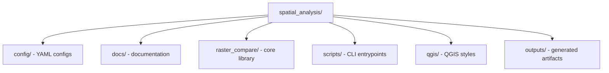

# Spatial Analysis Toolkit Documentation

Welcome to the documentation for the Spatial Analysis Toolkit. This toolkit provides
reproducible raster-to-raster comparison workflows, including alignment, dz
computation, summary statistics, and optional QGIS-ready artifacts.

## What this repo does

The pipeline aligns two rasters to a shared grid (using raster1 as the reference),
computes signed and absolute `dz` rasters, and generates reports and optional
vector overlays. Typical use cases include:

- Terrain change detection between surveys
- Cut/fill or erosion/accretion analysis
- Validation of a new DEM against a reference survey
- QA/QC of raster processing pipelines

## Repository structure (overview)

## Getting started

- Read the [pipeline overview](pipeline_overview.md) for concepts and outputs.
- Use the [configuration reference](config_reference.md) to build or modify configs.
- See [CLI reference](cli_reference.md) for command-line usage and examples.
- Check [troubleshooting](troubleshooting.md) for common issues.
